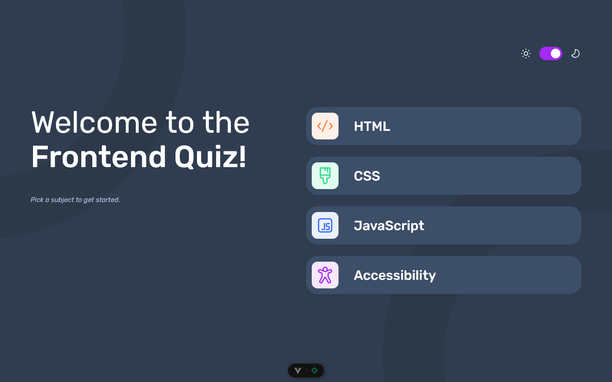
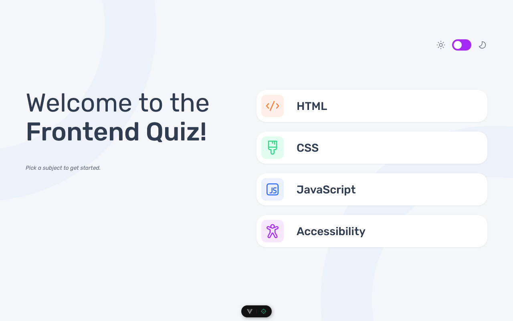
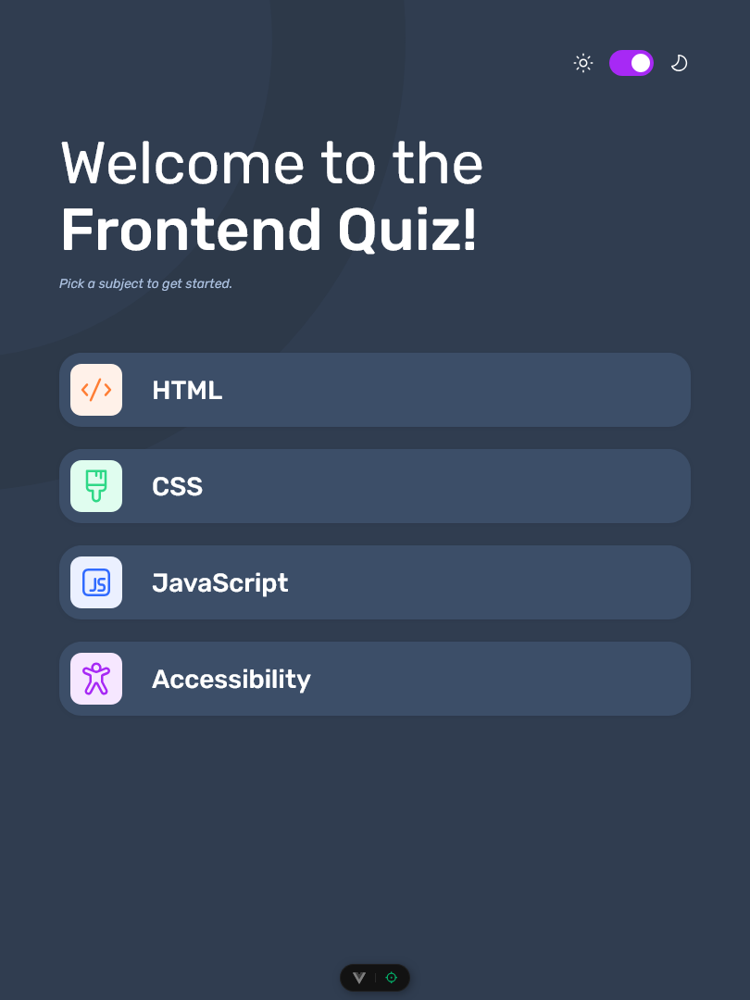
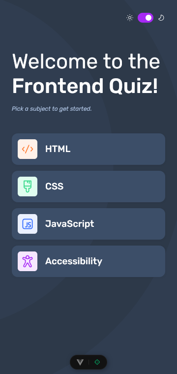

# Frontend Mentor - Frontend quiz app solution

This is a solution to the [Frontend quiz app challenge on Frontend Mentor](https://www.frontendmentor.io/challenges/frontend-quiz-app-BE7xkzXQnU). Frontend Mentor challenges help you improve your coding skills by building realistic projects.

## Table of contents

- [Overview](#overview)
  - [The challenge](#the-challenge)
  - [Screenshot](#screenshot)
  - [Links](#links)
- [My process](#my-process)
  - [Built with](#built-with)
  - [Continued development](#continued-development)
- [Author](#author)
- [Contribution](#contribution)

## Overview

### The challenge

Users should be able to:

- Select a quiz subject
- Select a single answer from each question from a choice of four
- See an error message when trying to submit an answer without making a selection
- See if they have made a correct or incorrect choice when they submit an answer
- Move on to the next question after seeing the question result
- See a completed state with the score after the final question
- Play again to choose another subject
- View the optimal layout for the interface depending on their device's screen size
- See hover and focus states for all interactive elements on the page
- Navigate the entire app only using their keyboard
- **Bonus**: Change the app's theme between light and dark

### Screenshot

### Links

- Solution URL: [Go to solution](https://www.frontendmentor.io/solutions/frontend-quiz-app-vue3---typescript---scss-yIgU1F2oiJ)
- Live Site URL: [Go to live site](https://frontend-quiz-app-acdev.vercel.app/)

## My process

### Built with

- Semantic HTML5 markup
- CSS / SCSS
- Flexbox
- CSS Grid
- Mobile-first workflow
- [Vue3](https://vuejs.org/) - The Progressive JavaScript Framework
- [Typescript](https://www.typescriptlang.org/) - Strongly typed JS

### Continued development

If i had time I would implement tests w/ vitest.

Take a look at my [FAQ Accordion app](https://github.com/mattari97/faq-accordion) if you want to see how it would look like.

## Author

- Frontend Mentor - [@AntoineC-dev](https://www.frontendmentor.io/profile/AntoineC-dev)

## Contribution

You can use this project for whatever you want. Don't forget to leave a ⭐.

- Fork the project to add it to your githug repositories.
- Clone it on your local machine from you repositories.
- cd into the project in your terminal
- Install all the dependencies by running `npm install` or `yarn install` or `pnpm install`.
- Open the project in your editor and start coding by running `npm run dev` or `yarn dev` or `pnpm dev`.
